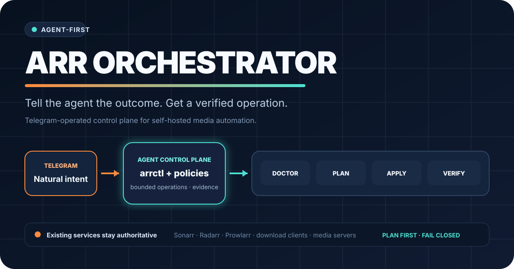

<p align="center">
  
</p>

# Arr Orchestrator

**Tell an agent what outcome you want. Let the repository turn that instruction into a safe, verified operation across your self-hosted media automation stack.**

Arr Orchestrator is an agent-first operational contract for Sonarr, Radarr, Prowlarr, download clients, and media servers. Telegram is the human interface. Deterministic CLI commands, service APIs, SSH operations, plans, and evidence are the agent interface.

> The repository foundation and execution backlog are ready. Service adapters and remote mutations remain deliberately unimplemented until their Go tasks are claimed and verified.

## Why this exists

A typical media stack spreads one outcome across several applications, credentials, mount paths, categories, profiles, and queues. Existing dashboards improve visibility; they do not automatically make the stack reproducible, explain failures, or prove that a repair worked.

Arr Orchestrator targets that gap:

```text
Telegram instruction → agent → doctor → plan → apply → verify → concise result
```

## Product boundaries

**The repository will:**

- discover capabilities and topology through explicit adapters;
- diagnose cross-service configuration and storage-path problems;
- produce a reviewable plan before mutation;
- apply bounded changes through official APIs or controlled SSH operations;
- verify the complete outcome and retain machine-readable evidence;
- fail closed when credentials, capabilities, or proof are missing.

**The repository will not:**

- replace Sonarr, Radarr, Prowlarr, a download client, or a media server;
- commit real API keys, host inventories, media titles, download history, or household configuration;
- treat a successful API response as proof that the user-visible outcome works;
- add a dashboard before the control plane is reliable.

## Repository map

| Path | Purpose |
| --- | --- |
| [`.go/`](.go/) | Repo-local product vision, principles, hierarchy, tasks, decisions, runs, and evidence |
| [`docs/vision.json`](docs/vision.json) | Tested design and engineering contract |
| [`docs/architecture.md`](docs/architecture.md) | System boundaries, components, and trust model |
| [`docs/onboarding.md`](docs/onboarding.md) | Fresh-clone route for developers and agents |
| [`docs/implementation-plan.md`](docs/implementation-plan.md) | Dependency-ordered product plan and Go backlog map |
| [`schemas/`](schemas/) | Machine-readable contract schemas |
| [`scripts/check.sh`](scripts/check.sh) | Complete local repository gate |
| [`examples/`](examples/) | Synthetic, public-safe contract examples |

## Installation

Requirements: Git, Bash, Python 3.11+, and network access for the pinned Go workflow bootstrap on the first run.

```bash
git clone https://github.com/viggomeesters/arr-orchestrator.git
cd arr-orchestrator
bash scripts/check.sh
./go status . --json
./go next .
```

The local gate uses only the Python standard library. The `./go` launcher resolves the exact pinned `go-workflow-stack` release from `.go/project.json` and caches it outside the repository.

## Development

Development is driven by the repo-local Go backlog rather than an informal issue list:

```bash
./go status . --json
./go next .
./go claim <task-id> --repo . --agent <agent-name>
```

Work only inside the claimed task scope, use synthetic fixtures, run the task-specific verification, and finish with `make check` plus a critic/recheck pass. See [Onboarding](docs/onboarding.md) and [Contributing](CONTRIBUTING.md) for the complete route.

## Agent workflow

`Go` is the only public execution command. An agent should:

1. read `.go/vision.json`, `.go/architecture-principles.json`, and `.go/hierarchy.json`;
2. run `bash scripts/check.sh` and `./go status . --json`;
3. route the instruction with `./go router . --command go --intent "<instruction>" --json`;
4. create or claim one scoped task;
5. build, verify, critic/recheck, repair, and record evidence;
6. stop only at a real repository, authority, privacy, or destructive-action gate.

See [`AGENTS.md`](AGENTS.md) for the full operating contract.

## Validation

```bash
make check
python3 scripts/validate_vision.py
python3 scripts/check_public_safety.py
python3 scripts/check_hero.py
```

`make check` runs all repository gates, including repo-local Go validation, JSON Schema checks, documentation link checks, hero structure checks, and public-safety guards.

## Runtime data and credentials

Real deployment state belongs outside Git. The implementation will use operating-system data/config directories, for example:

```text
~/.config/arr-orchestrator/    # user configuration and secret references
~/.local/share/arr-orchestrator/ # inventories, evidence, plans, and caches
```

Credentials must come from environment variables, a secret manager, or protected local files. Synthetic fixtures are the only deployment examples accepted in this public repository.

## Documentation

- [Product and design contract](docs/vision.json)
- [Architecture](docs/architecture.md)
- [Onboarding](docs/onboarding.md)
- [Implementation plan](docs/implementation-plan.md)
- [Security model](docs/security-model.md)
- [Repository foundation evidence](docs/repository-foundation.md)

## Contributing and security

Read [`CONTRIBUTING.md`](CONTRIBUTING.md) before opening a change. Report vulnerabilities through the private process in [`SECURITY.md`](SECURITY.md); do not place credentials, live host data, media history, or exploit details in a public issue.

## Status

The repository foundation is complete at `v0.1.0`. Product delivery proceeds through the validated repo-local Go backlog. The first recommended execution command is:

```text
Go
```

## License

[MIT](LICENSE) © 2026 Viggo Meesters.
