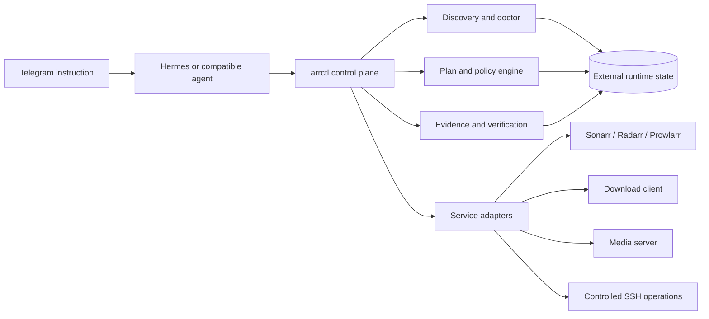

# Architecture

Arr Orchestrator is an agent-operated control plane over existing media automation services. It keeps the human surface conversational while making every machine action deterministic, bounded, and verifiable.



## Components

### Telegram command surface

The user states an outcome in normal language. Telegram carries intent and concise progress, not credentials or raw deployment state.

### Agent router

Hermes or another compatible agent reads `.go/`, selects a scoped task or operation, invokes deterministic commands, and returns evidence. The agent may reason about intent but may not invent service state.

### `arrctl` control plane

The planned CLI is the stable machine interface. Its command model is:

```text
doctor → plan → apply → verify
```

Every command will support structured output. Read-only discovery remains separate from mutation.

### Shared transport and service adapters

The shared read-only transport owns endpoint and credential resolution, URL/TLS policy, timeouts, bounded retries, HTTP-method policy, typed transport failures, and redaction. Each adapter owns service-specific API-version discovery, capability reporting, any explicitly classified authentication handshake, request/response normalization, and fixtures. The core does not depend directly on service-specific response shapes, and adapters do not implement private HTTP stacks.

### External runtime state

Real configuration, secrets, inventories, generated plans, evidence, and caches live outside Git under operating-system config/data directories. The repository contains schemas and synthetic examples only.

## Trust and side-effect model

| Operation | Default authority | Required proof |
| --- | --- | --- |
| Capability discovery | Read-only | Endpoint/version readback |
| Configuration diagnosis | Read-only | Rule result with source evidence |
| Plan generation | Local write outside Git | Deterministic diff and policy verdict |
| Configuration apply | Bounded remote write | Approved plan, backup where applicable, API readback |
| Cleanup or deletion | Explicit human authority | Exact targets, dry-run evidence, post-action readback |
| Stack update | Explicit scoped authority | Version diff, health checks, service smoke |

## Data flow boundaries

1. Natural-language intent becomes a structured operation request.
2. Discovery reads current capabilities and configuration.
3. Policy evaluates desired state against current state.
4. Plan records exact proposed mutations and blocked assumptions.
5. Apply executes only allowlisted plan operations.
6. Verify re-reads services and checks the end-to-end outcome.
7. Redacted evidence is stored outside Git and summarized to Telegram.

## Failure model

The system fails closed when a service is unreachable, API versions are unsupported, path identity is ambiguous, credentials are missing, a plan changes after review, backups fail, or verification cannot prove the outcome.

## Extension points

- service adapters;
- diagnosis rules;
- desired-state schemas;
- policy packs;
- evidence renderers;
- Telegram/Hermes command routing.
